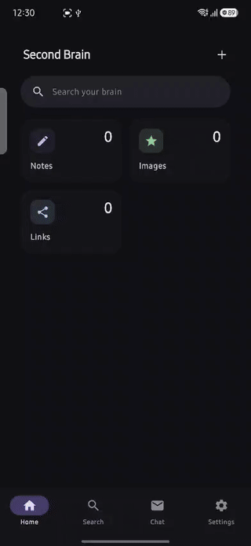
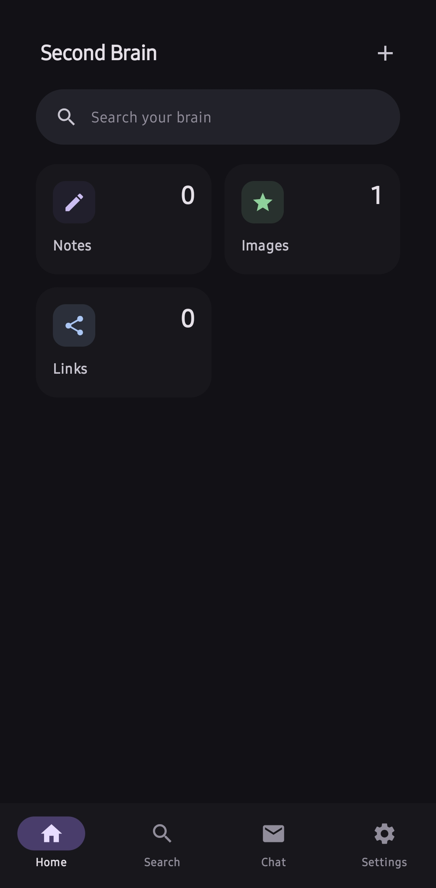
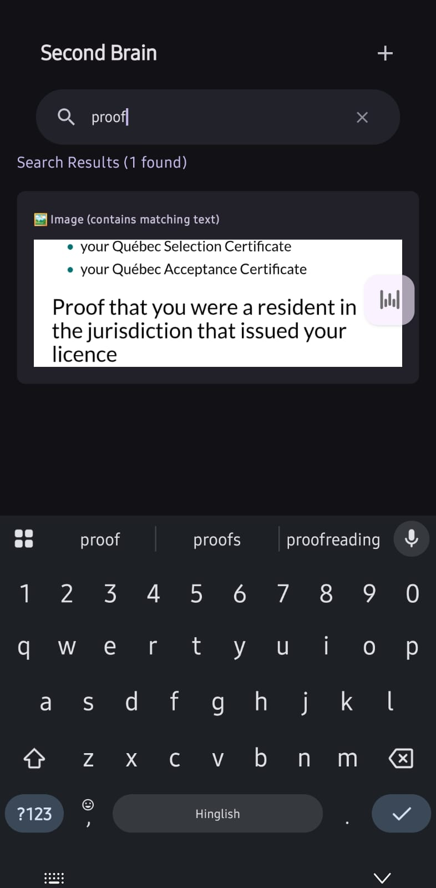
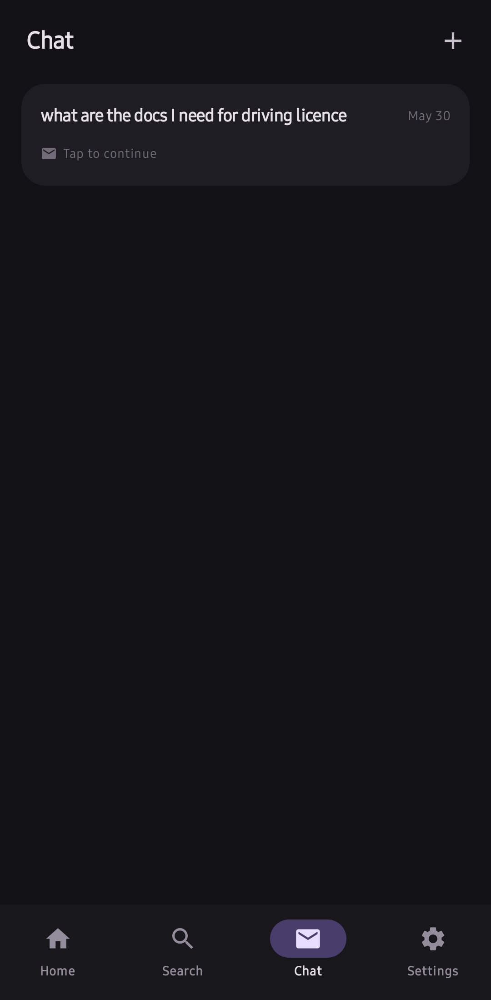
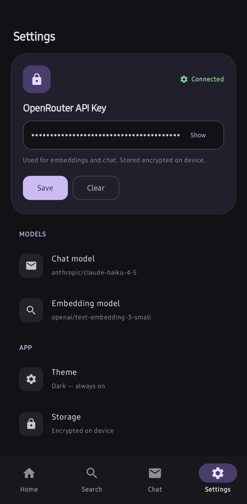

<div align="center">

# Second Brain

**A local-first Android second brain. Capture anything. Search everything. Chat with your own content using AI.**

No cloud. No subscription. No data leaves your phone.

[](LICENSE)
[](https://android-arsenal.com/api?level=28)
[](https://kotlinlang.org)
[](https://developer.android.com/training/data-storage/room)
[](https://developer.android.com/jetpack/compose)

<!-- Replace the line below with your actual GIF path after recording -->



</div>


## Why This Exists

Every second brain app is cloud-dependent, expensive, or both. Notion goes offline and you lose your notes. Obsidian mobile is a desktop app crammed onto a phone. AI features require a monthly subscription to someone else's infrastructure.

Second Brain stores everything in a local Room database on your device. Your notes, images, and links never leave your phone. The AI features use your own OpenRouter API key so there is no subscription, no middleman, and no per-query pricing beyond what you pay OpenRouter directly.

---

## What It Does

| Feature | Detail |
|---|---|
| **Capture via share sheet** | Appears in Android share menu for instant text, image, and link capture |
| **Search images by content** | Offline OCR via Google ML Kit extracts and indexes text from photos |
| **Chat with your saved content** | RAG pipeline: embed your question, retrieve relevant items, answer using only your data |
| **Tags** | Add tags to any item, filter lists by tag, search by tag name |
| **Edit and delete** | Long press any item to edit, re-tag, or delete |
| **Multi-thread chat** | Named conversation threads, each auto-titled from the first message |
| **Fully offline** | All core features work with no internet. AI chat requires connection only during the API call |

---

<!-- ## Screenshots 


| Main Screen | Chat | Tags |
|---|---|---|
|  |  |  |  |

-->

## How the AI Works

```
You type:    "what are my travel plans for June?"

App:         embeds your question via OpenRouter
             runs cosine similarity against all stored embeddings
             retrieves top 4 saved items scoring above 0.3 similarity
             sends them as context to Claude Haiku via OpenRouter

Claude:      answers using only your saved content
             lists which items were used as sources below every reply
```

No hallucination by design. If the answer is not in your saved content, the model says so explicitly. Sources are shown under every response so you can verify the answer yourself.

---

## Getting Started

### Prerequisites

- Android Studio Hedgehog or later
- Android device running API 28 (Android 9.0) or higher
- An [OpenRouter](https://openrouter.ai) API key for AI features — free to get, pay only per query

### Build and Install

```bash
git clone https://github.com/suyash308/secondbrain.git
cd secondbrain
```

Open in Android Studio, wait for Gradle sync, connect your device, click Run.

### Set Up AI

1. Tap the gear icon in the top bar
2. Paste your OpenRouter API key
3. Tap Save

Start saving content and ask questions in the chat tab.

### AI Cost Reference

| What | Model | Cost |
|---|---|---|
| Embedding per item saved | text-embedding-3-small | ~$0.000004 |
| Chat query (avg 1500 tokens) | claude-haiku-4-5 | ~$0.002 |
| 200 chat queries per month | claude-haiku-4-5 | ~$0.40 |

Personal use costs less than a cup of coffee per month.

---

## Features In Detail

### Capture

- Share any text, image, or link from any Android app directly into Second Brain
- Images are saved locally and processed with offline OCR automatically
- Links fetch title, description, and preview image in the background via Jsoup
- Upload images directly from your gallery via the upload button

### Search

- Searches text content, link metadata, OCR-extracted image text, and tag names simultaneously
- Active tag filter combines with search query using AND logic
- Results appear instantly as you type

### Tags

- Add multiple tags to any item via long press
- Tags auto-lowercased, spaces replaced with hyphens
- Horizontal filter bar above each content list
- Searching a tag name surfaces all items tagged with it even if the content does not match

### RAG Chat

- Multiple named conversation threads
- Each conversation auto-titled from its first message
- Last 20 messages sent as context on every query for multi-turn coherence
- Embeddings generated automatically when any item is saved
- Background job on first launch embeds all existing items silently
- Source attribution on every answer

### Edit and Delete

- Long press any card: bottom sheet shows Edit, Tags, Delete
- Edit available for text items (full content) and link items (URL re-fetches metadata)
- Delete removes the database record and the local file for images

---

## Technical Stack

| Layer | Technology |
|---|---|
| Language | Kotlin |
| UI | Jetpack Compose + Material 3 |
| Database | Room (local, version 4) |
| Reactive streams | Kotlin Flow + coroutines |
| OCR | Google ML Kit 16.0.1 (fully offline) |
| Image loading | Coil |
| Link scraping | Jsoup |
| Embeddings | OpenRouter → openai/text-embedding-3-small (1536 dimensions) |
| Chat | OpenRouter → anthropic/claude-haiku-4-5 |
| HTTP | HttpURLConnection only, no OkHttp or Retrofit |
| API key storage | EncryptedSharedPreferences, AES-256-GCM, Android Keystore |
| JSON | Gson |

---

## Project Structure

```
app/src/main/java/com/example/secondbrain/
├── MainActivity.kt                  # Single activity, all UI logic
├── data/
│   ├── AppDatabase.kt              # Room database (version 4)
│   ├── DatabaseManager.kt          # Central access point for all DB operations
│   ├── SettingsManager.kt          # Encrypted API key storage
│   ├── OpenRouterService.kt        # Embeddings + chat API calls via HttpURLConnection
│   ├── EmbeddingUtils.kt           # Cosine similarity, serialize, parse
│   ├── entities/
│   │   ├── TextItemEntity.kt       # content, timestamp, embedding, summary
│   │   ├── ImageItemEntity.kt      # localPath, extractedText, timestamp, embedding
│   │   ├── LinkItemEntity.kt       # url, title, description, imageUrl, timestamp, embedding
│   │   ├── TagEntity.kt
│   │   ├── TextItemTagCrossRef.kt
│   │   ├── ImageItemTagCrossRef.kt
│   │   ├── LinkItemTagCrossRef.kt
│   │   ├── ChatMessageEntity.kt    # role, content, sourceIds, sourceTypes, conversationId
│   │   └── ConversationEntity.kt  # title, createdAt
│   ├── dao/
│   │   ├── TextItemDao.kt
│   │   ├── ImageItemDao.kt
│   │   ├── LinkItemDao.kt
│   │   ├── TagDao.kt
│   │   ├── ChatMessageDao.kt
│   │   └── ConversationDao.kt
│   ├── repository/
│   │   ├── TextItemRepository.kt
│   │   ├── ImageItemRepository.kt
│   │   └── LinkItemRepository.kt
│   └── mapper/
│       └── DataMapper.kt
└── ui/theme/
    ├── Color.kt
    ├── Theme.kt
    └── Type.kt
```

---

## Database Schema

### Version History

| Version | Changes |
|---|---|
| 1 | Baseline: TextItemEntity, ImageItemEntity, LinkItemEntity |
| 2 | Tags: TagEntity, three CrossRef junction tables |
| 3 | RAG: embedding column on all item entities, ChatMessageEntity |
| 4 | Multi-thread chat: ConversationEntity, conversationId on ChatMessageEntity |

### Key Entities

| Entity | Key Columns |
|---|---|
| TextItemEntity | id, content, timestamp, embedding (nullable), summary (nullable) |
| ImageItemEntity | id, originalUri, localPath, extractedText (nullable), timestamp, embedding (nullable) |
| LinkItemEntity | id, url, title, description, imageUrl, timestamp, embedding (nullable) |
| ChatMessageEntity | id, role, content, timestamp, sourceIds, sourceTypes, conversationId |
| ConversationEntity | id, title, createdAt |

---

## Data Flow

```
Content saved
  └── Room DB insert
        └── Embedding generated via OpenRouter (background, IO dispatcher)
              └── Stored in embedding column

Question sent in chat
  └── Question embedded via OpenRouter
        └── Cosine similarity vs all stored embeddings
              └── Top 4 items above 0.3 threshold retrieved
                    └── Sent as context to Claude Haiku
                          └── Answer + source IDs saved to ChatMessageEntity
```

```
Image saved
  └── Room DB insert
        └── Background OCR (offline, Google ML Kit)
              └── extractedText saved
                    └── Embedding generated from extractedText
                          └── Stored in embedding column
```

---

## Permissions

| Permission | Why |
|---|---|
| `INTERNET` | Link metadata fetch, embeddings API, chat API |
| `READ_MEDIA_IMAGES` | Gallery access on Android 13+ (API 33+) |
| `READ_EXTERNAL_STORAGE` | Gallery access on Android 9 to 12 (API 28 to 32) |

---

## Build Configuration

| Setting | Value |
|---|---|
| Minimum SDK | 28 (Android 9.0) |
| Target SDK | 36 (Android 15) |
| Compile SDK | 36 |
| Kotlin | 1.9+ |

**16KB page size:** Uses ML Kit 16.0.1, which ships native libraries aligned at 16KB boundaries. Required for Google Play submissions targeting Android 15+.

**API key security:** The OpenRouter key is stored in EncryptedSharedPreferences using AES-256-GCM with an Android Keystore-backed master key. It is never logged, never hardcoded, and never transmitted except as an HTTPS header directly to OpenRouter.

---

## Troubleshooting

| Problem | Fix |
|---|---|
| App not in share sheet | Launch the app at least once. Only `text/plain` and `image/*` are supported. |
| Images not loading | Check storage permissions in device Settings. |
| OCR not extracting text | Image must contain clear Latin-script text. Runs fully offline. |
| Link preview missing | Some sites block scraping. Raw URL shown as fallback. |
| Chat says "could not find" | Save content about the topic first. Embeddings need ~10s after saving. |
| Chat not responding | Check API key in Settings. Verify internet connection. |
| Embeddings not generating | Ensure API key is saved before adding content. |

### Debug Logging

Filter logcat by `DEBUG`:

```
DEBUG: OCR completed successfully!
DEBUG: Image embedding stored after OCR
DEBUG: Image metadata updated successfully in database
DEBUG: Link metadata updated successfully in database
```

---

## Contributing

1. Fork the repository
2. Create a feature branch: `git checkout -b feature/your-feature`
3. Make your changes following the patterns in `CLAUDE.md`
4. Test on a real device
5. Submit a pull request with a clear description of what changed and why

Bug reports and feature requests: open a GitHub issue.

---

## License

MIT License. See [LICENSE](LICENSE) for details.

---

## Acknowledgments

- [Google ML Kit](https://developers.google.com/ml-kit) for offline OCR
- [OpenRouter](https://openrouter.ai) for unified AI API access
- [Jetpack Compose](https://developer.android.com/jetpack/compose) for the UI framework
- [Room](https://developer.android.com/training/data-storage/room) for local data persistence
- [Material Design 3](https://m3.material.io) for the design system

---

## Download & Install

1. Go to [Releases](https://github.com/your-username/secondBrain/releases/latest)
2. Download the latest `.apk` file
3. On your Android phone, enable **Settings > Install unknown apps**
4. Open the downloaded APK and install

<div align="center">

**Second Brain** — Your digital memory, organized and searchable. 🧠

*Local-first. Privacy-first. Yours.*

</div>